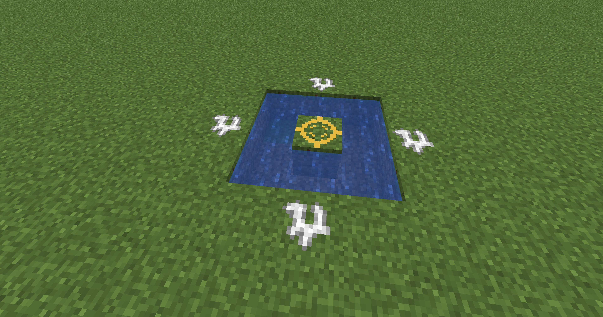

# Magic Rituals

`Magic Rituals` is a NeoForge mod for Minecraft `1.21.11` centered around magical patterns built from chalk runes.

At the moment the mod is an early prototype with one fully working ritual and the basic system for matching ritual patterns in the world.

## Current functionality

- Two rune blocks are available: a regular chalk rune and a golden central rune.
- Rituals are assembled directly in the world from a fixed block pattern.
- Right click a rune with an empty hand to attempt ritual activation.
- If the pattern does not match, the mod returns debug information about the first mismatch.

## Implemented ritual

### Cross ritual

The current ritual uses:

- 1 golden rune in the center
- 4 regular chalk runes in a cross shape at distance 2
- Water placed in a ring around the center one block lower

When the structure is assembled correctly and activated, the ritual:

- removes the surrounding water blocks
- starts rain in the world

## Screenshot

Example of the currently implemented ritual:

