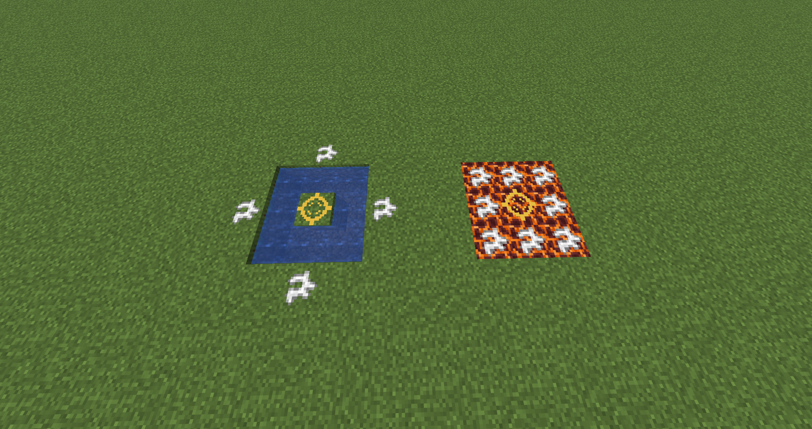

# Magic Rituals

`Magic Rituals` is a NeoForge mod for Minecraft `1.21.11` centered around magical patterns built from chalk runes.

At the moment the mod is an early prototype with a working ritual system, item-based ritual recipes, staged activation, particles, sounds, and two implemented rituals.

## Current functionality

- Two rune blocks are available: a regular chalk rune and a golden central rune.
- Rituals are assembled directly in the world from a block pattern plus an item recipe.
- Rituals are activated by right-clicking the golden rune with an empty hand.
- After validation, recipe items are absorbed one by one over time before the ritual completes.
- If the structure breaks or an item disappears during absorption, the ritual is cancelled and absorbed items are dropped back.
- Ritual actions are accompanied by particles and sounds.
- Activation/debug details are logged on the server; players receive short red failure messages in-game.

## Implemented rituals

### Raincaller ritual

Uses:

- 1 golden rune in the center
- 4 regular chalk runes in a cross shape at distance 2
- Water placed in a ring around the center one block lower
- Recipe: `4x Prismarine Shard`, `8x Kelp`, `1x Nautilus Shell`

Effect:

- removes the surrounding water blocks
- starts rain in the world

### Clear Skies ritual

Uses:

- 1 golden rune in the center
- 8 regular chalk runes around it in a `3x3` ring
- A full `3x3` layer of magma blocks under the ritual
- Recipe: `4x Blaze Powder`, `8x Glowstone Dust`, `2x Sunflower`

Effect:

- clears rain and thunder

## Screenshot

Example of the Raincaller ritual:

## Ritual activation demo

<video controls>
  <source src="docs/ritual_activation.mp4" type="video/mp4">
</video>
